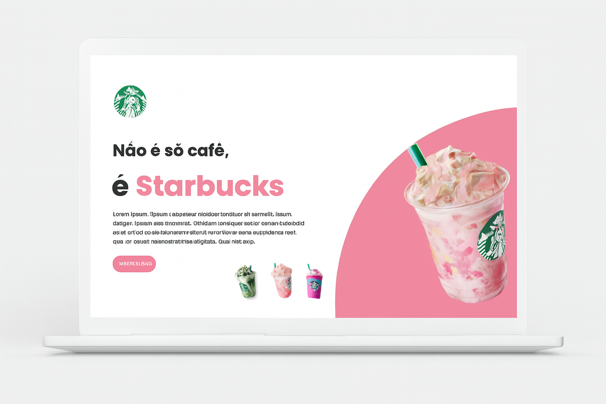
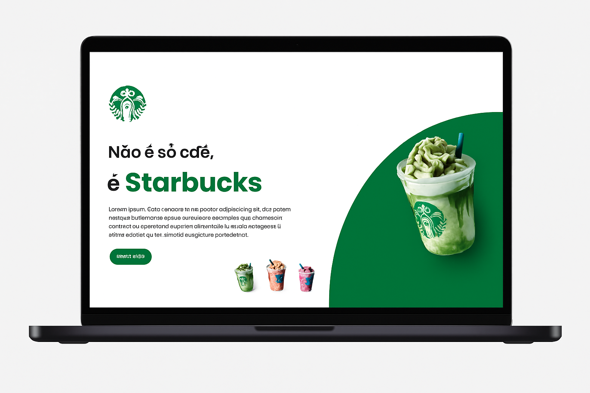
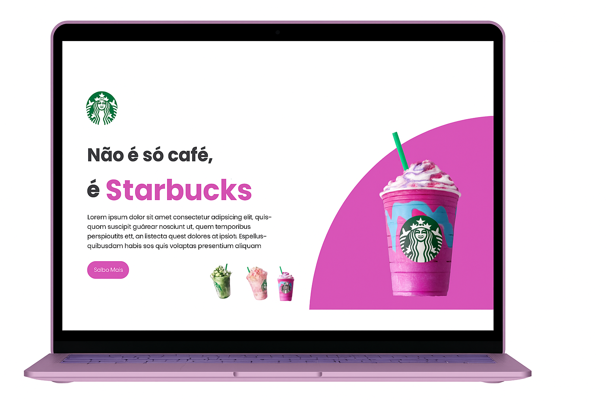

# Projeto-11.Starbucks  
Clone responsivo do site da Starbucks ☕

Este repositório apresenta uma versão **clone** do site da Starbucks criada com fins de estudo e prática de front-end: HTML5, CSS3, design responsivo e JavaScript.  
O objetivo principal é reconstruir uma experiência de site moderno, adaptável a diferentes dispositivos (desktop, tablet, mobile) e com efeitos interativos simples.

---

## 🎯 Visão Geral  
- Replicação da estrutura visual e layout de um site corporativo (inspirado no site da Starbucks)  
- Ênfase em boas práticas de semântica HTML, estilos CSS bem organizados e responsividade via media queries  
- JavaScript para pequenas interações e para reforçar o fluxo de trabalho típico de front-end  
- Projeto ideal para quem deseja praticar e demonstrar habilidades de desenvolvimento web moderno

---

## 🖼 Preview  
Veja abaixo alguns exemplos visuais do layout em diferentes modelos/luzes:

  
  
  

Ou acesse a versão hospedada: [Projeto-11.Starbucks](https://alexandresilva78.github.io/Projeto-11.Starbucks/)

---

## 🛠 Tecnologias Utilizadas  
- **HTML5**: Estrutura semântica do site  
- **CSS3**: Estilização, layout, animações simples  
- **Responsividade (Media Queries)**: Adaptação para desktop, tablet e mobile  
- **JavaScript**: Manipulação de DOM, interatividade leve  

---

## 📁 Estrutura do Projeto  
Projeto-Starbucks/
├── index.html
├── styles.css
├── responsive.css
├── scripts.js
└── assets/
├── img/
└── icons/

yaml
Copiar código
*Obs.: Você encontrará também uma pasta `assets` contendo imagens, ícones e demais recursos.*

---

## 🚀 Como usar  
1. Clone este repositório:  
   ```bash
   git clone https://github.com/AlexandreSilva78/Projeto-11.Starbucks.git

   ---
   
🎓 Objetivo de Aprendizagem

Aplicar estruturação semântica com HTML

Criar layouts modernos e limpos com CSS

Praticar design responsivo para diversos dispositivos

Inserir interatividade básica com JavaScript

Aumentar o portfólio com um projeto completo de front-end

📚 Referência

Projeto inspirado por: Versão hospedada no GitHub Pages

🤝 Contribuições

Este é um projeto pessoal para prática, portanto, não há processo formal de contribuição. No entanto, sinta-se à vontade para forkar, ajustar ou usar como base para seus próprios estudos.
Se desejar, você pode entrar em contato para sugerir melhorias ou deixar feedback via “Issues”.

📄 Licença

Este repositório está disponibilizado para uso pessoal e educacional. Sinta-se livre para utilizá-lo como base, porém, melhorias, reuso ou publicação comercial devem respeitar os direitos de propriedade do design original da Starbucks.

Obrigado pela visita!
   
